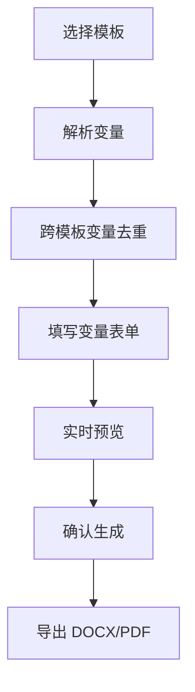
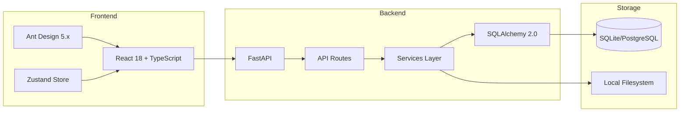
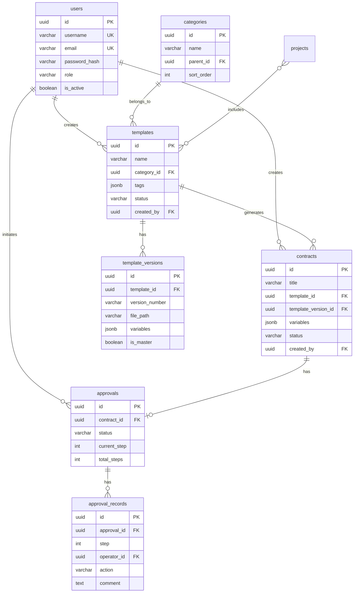
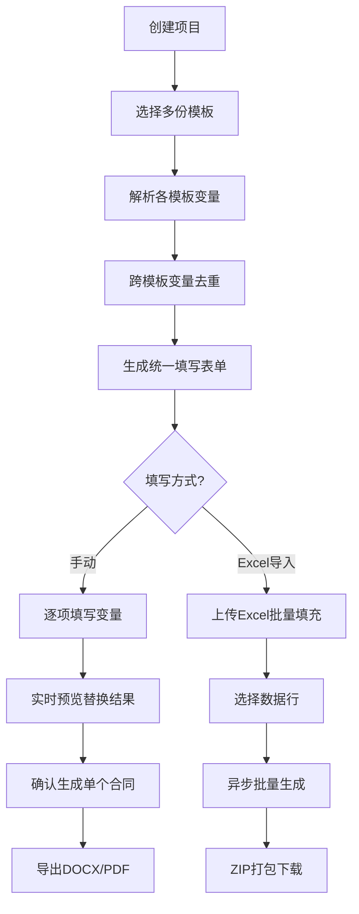
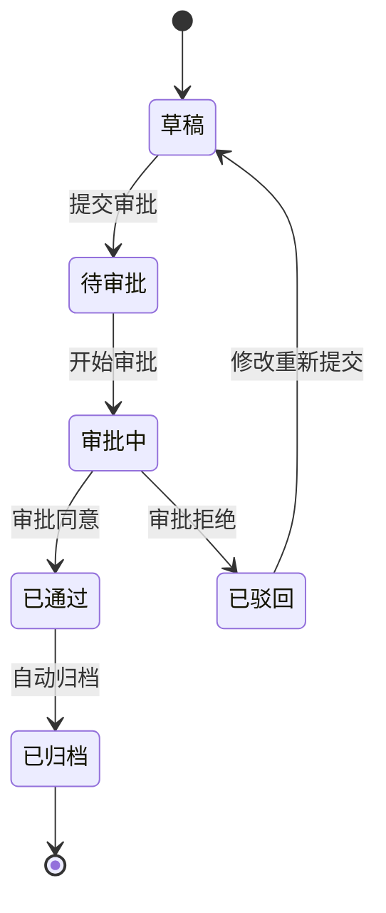

# 律所IPO签字页管理系统 — 项目报告

---

## 1. 业务理解

### 1.1 业务场景

在IPO（首次公开募股）过程中，发行人需向监管机构提交大量法律文件，其中**签字页（Signature Page）**是各方当事人签署确认的关键文档页面。一份典型的IPO申报材料涉及数十甚至上百份签字页，涵盖股东会决议、董事会决议、律师见证函、各类协议等。

签字页的核心痛点在于**信息高度重复**：同一位股东/董事/律师的姓名、身份证号、住址等信息会在多份签字页中反复出现。传统手工填写方式下，一旦某位股东信息变更，需要逐一修改所有相关签字页，耗时且易出错。

### 1.2 核心痛点

| ID | 痛点 | 严重程度 | 解决方向 |
|----|------|---------|---------|
| P1 | 模板分散，查找困难 | 高 | 统一模板库 + 分类标签 |
| P2 | 版本混乱，难以辨别最新版 | 高 | 版本控制 + 主版本标记 |
| P3 | 合同数据重复录入，效率低 | 高 | 变量模板 + 自动填充 |
| P4 | 审批流程不透明，进度难追踪 | 中 | 审批工作流 + 状态看板 |
| P5 | 合同生成后格式损坏 | 中 | 模板预览 + 格式校验 |
| P6 | 缺乏合同归档与搜索 | 中 | 合同归档 + 全文搜索 |

### 1.3 核心价值主张

**变量去重（Variable Deduplication）** 是本系统的核心价值：当多份模板共享相同变量名（如`【张三】`）时，只需填写一次即可自动应用到所有关联模板，彻底消除重复录入。

### 1.4 核心业务流程

---

## 2. 软件架构

### 2.1 系统架构

### 2.2 技术选型理由

| 技术 | 选型理由 |
|------|---------|
| FastAPI | 异步高性能，自动生成 OpenAPI 文档，类型提示友好 |
| React 18 + TypeScript | 组件化开发，强类型保障，生态成熟 |
| Ant Design 5.x | 企业级 UI 组件库，表格/表单/步骤条等开箱即用 |
| SQLAlchemy 2.0 async | Python ORM 标准，2.0 版本原生支持 async，类型安全 |
| docxtpl / python-docx | 成熟的 Word 模板渲染方案，支持变量替换和格式保持 |
| SQLite（MVP） | 零配置部署，单文件数据库，开发阶段无需额外服务 |

### 2.3 三层架构

后端采用经典的 **三层架构**，业务逻辑与路由解耦：

| 层 | 职责 | 示例 |
|----|------|------|
| API Routes（`api/`） | 请求验证、响应序列化 | `templates.py`, `contracts.py` |
| Services（`services/`） | 业务逻辑编排 | `template_service.py`, `contract_service.py` |
| Models（`models/`） | 数据模型定义、ORM 映射 | `template.py`, `contract.py` |

### 2.4 MVP 简化概览

MVP 阶段在基础设施层面做了多项简化，详见第5节"实现权衡"。

---

## 3. 数据模型

### 3.1 ER 关系图

### 3.2 核心表说明

| 表名 | 用途 | 关键约束 |
|------|------|---------|
| users | 用户账户与权限 | username/email 唯一，role 支持四种角色 |
| categories | 模板分类树 | parent_id 自引用，支持多级分类 |
| templates | 模板主表 | status 管控生命周期 |
| template_versions | 模板版本 | (template_id, version_number) 联合唯一，is_master 标记主版本 |
| contracts | 生成的合同 | variables JSONB 存储填写值 |
| approvals | 审批单 | current_step/total_steps 支持多步审批 |
| approval_records | 审批操作记录 | action 枚举：approve/reject/transfer |
| projects | 项目（模板集合） | 多对多关联模板，用于变量去重 |
| audit_logs | 审计日志 | 记录写操作，混合存储（DB + JSONL） |

---

## 4. 关键接口与流程

### 4.1 核心 API 端点

**模板管理**

| 方法 | 端点 | 功能 |
|------|------|------|
| GET | /api/v1/templates | 模板列表（分页、搜索、分类过滤） |
| POST | /api/v1/templates | 上传创建模板 |
| GET | /api/v1/templates/{id} | 模板详情 |
| DELETE | /api/v1/templates/{id} | 删除模板 |
| GET | /api/v1/templates/{id}/variables | 解析模板变量 |
| GET | /api/v1/templates/{id}/versions | 版本列表 |

**合同生成**

| 方法 | 端点 | 功能 |
|------|------|------|
| POST | /api/v1/contracts/preview | 变量填充预览 |
| POST | /api/v1/contracts | 生成合同 |
| GET | /api/v1/contracts/{id}/export | 导出 Word/PDF |
| POST | /api/v1/contracts/parse-excel | 解析 Excel 表头与数据行 |
| POST | /api/v1/contracts/batch-from-rows-async | 异步批量生成 |
| GET | /api/v1/contracts/tasks/{id} | 查询异步任务状态 |
| GET | /api/v1/contracts/tasks/{id}/download-zip | 下载批量生成 ZIP |

**项目管理与变量去重**

| 方法 | 端点 | 功能 |
|------|------|------|
| POST | /api/v1/projects | 创建项目（关联模板） |
| GET | /api/v1/projects/{id}/deduplicated-variables | 获取去重后变量列表 |

**认证与审计**

| 方法 | 端点 | 功能 |
|------|------|------|
| POST | /api/v1/auth/login | 登录获取 JWT |
| GET | /api/v1/auth/me | 当前用户信息 |
| GET | /api/v1/audit/logs | 审计日志列表（管理员） |

### 4.2 签字页生成完整流程

### 4.3 变量去重机制

变量去重是系统核心特性，工作原理如下：

1. **变量提取**：使用正则 `【(.+?)】` 从 DOCX 模板中提取所有变量名
2. **跨模板合并**：项目关联多份模板时，相同变量名自动合并为同一个填写项
3. **来源映射**：每个去重变量记录其出现的模板列表，便于追踪
4. **一次填写全量生效**：用户只需填写一次去重变量，生成时自动应用到所有关联模板

示例：模板A含`【公司名称】`、`【法定代表人】`，模板B含`【公司名称】`、`【注册资本】`，去重后用户只需填写3个变量（`公司名称`仅填一次）。

### 4.4 审批状态机

---

## 5. 实现权衡

### 5.1 MVP 简化项

| 原设计 | MVP 实现 | 简化理由 |
|--------|---------|---------|
| PostgreSQL 15 | SQLite | 减少部署依赖，开发阶段零配置启动 |
| MinIO 对象存储 | 本地文件系统 | 减少基础设施依赖，`utils/storage.py` 抽象层保留切换能力 |
| 多步审批流 | 单步审批 | 降低状态机复杂度，数据库 schema 已预留多步字段 |
| Celery + Redis 异步队列 | asyncio 后台任务 | 减少依赖服务，`task_manager.py` 内存管理任务状态 |
| 浏览器内 PDF 预览 | 下载后预览 | 避免前端 PDF 渲染库兼容性问题 |
| 邮件/应用内通知 | 无通知 | MVP 阶段非核心功能 |
| RBAC 角色权限 | 简单 JWT + mock 角色 | → 后续已完整实现（见5.2） |

### 5.2 额外实现：RBAC 与审计系统

在 MVP 基础上，额外实现了完整的 RBAC 权限和审计系统：

**RBAC 权限系统**：4 种角色（super_admin / template_admin / approver / user），`require_role` 依赖注入实现接口级权限控制，前端 `RoleGuard` 组件实现 UI 级权限控制。

**审计日志系统**：中间件自动记录写操作（POST/PUT/DELETE），装饰器支持精细化控制（跳过读操作、跳过登录），混合存储策略（DB 查询 + JSONL 文件持久化备份）。

### 5.3 设计预留的扩展点

- `utils/storage.py` 抽象层：可无缝切换至 MinIO
- `task_manager.py` 接口兼容：可替换为 Celery worker
- 数据库 `approvals` 表 `current_step/total_steps` 字段：已支持多步审批
- SQLAlchemy async engine：可切换至 PostgreSQL 连接串

---

## 6. 测试与验证结果

### 6.1 测试统计

| 类别 | 测试文件 | 测试数量 | 状态 |
|------|---------|---------|------|
| 单元测试 - 变量解析 | test_variable_parser.py | 13 | 全部通过 |
| 单元测试 - 文档生成 | test_doc_generator.py | 7 | 全部通过 |
| API 测试 - 认证权限 | test_auth.py | 27 | 全部通过 |
| API 测试 - 审计日志 | test_audit.py | 10 | 全部通过 |
| API 测试 - 模板管理 | test_templates_api.py | 7 | 全部通过 |
| API 测试 - 项目管理 | test_projects_api.py | 5 | 全部通过 |
| API 测试 - 合同生成 | test_contracts_api.py | 8 | 全部通过 |
| 端到端测试 | test_e2e_flow.py | 1 | 全部通过 |
| **后端合计** | | **78** | **全部通过** |
| 前端组件测试 | Home/TemplateManage/ContractGenerate | 10 | 全部通过 |
| **总计** | | **88** | **全部通过** |

### 6.2 测试覆盖范围

**后端测试覆盖**：
- 变量解析：中文方括号`【变量名】`提取、多变量、去重、花括号格式兼容、样例模板验证
- 文档生成：变量替换、多变量替换、未填变量保留、输出文件有效性、批量生成、预览
- 认证权限：密码哈希、JWT 创建/解码/过期、登录成功/失败、用户注册、角色权限控制、无 token 保护
- 审计日志：中间件记录写操作/跳过读操作/跳过登录、API 权限、分页过滤、详情查询

**前端测试覆盖**：
- 首页：统计卡片渲染、最近项目列表、操作按钮
- 模板管理：模板列表、上传按钮、搜索框
- 合同生成：Steps 组件、项目名输入、模板表格

### 6.3 端到端验证

完整流程验证通过：Excel 导入 3 行数据 → 异步批量生成 9 份合同（3行 × 3模板） → ZIP 打包下载 320KB，前后端构建均通过。

---

## 7. 未解决问题

| # | 限制 | 影响 | 潜在风险 |
|---|------|------|---------|
| 1 | SQLite 并发写入限制 | 多用户同时生成合同时可能出现锁等待 | 生产环境需切换 PostgreSQL |
| 2 | 无浏览器内 PDF 预览 | 用户需下载后才能查看 PDF | 可嵌入 pdf.js 实现 |
| 3 | 无邮件/消息通知 | 审批结果无法及时通知 | 集成 SMTP 或 WebSocket 推送 |
| 4 | 审批流为单步 | 无法支持多级审批场景 | 数据库已预留多步字段 |
| 5 | 文件存储无分布式支持 | 本地文件系统不支持多实例部署 | 需切换至 MinIO/OSS |
| 6 | 变量类型校验未实现 | 变量填写无格式验证（如身份证号） | 需扩展变量类型系统 |
| 7 | 无模板在线编辑 | 需上传修改后的 Word 文件 | 可集成富文本编辑器 |

---

## 8. 如再给一个月

在现有 MVP 基础上，一个月内可实现以下升级：

**基础设施升级**：
- PostgreSQL + MinIO 生产级部署，支持高并发和分布式存储
- Celery + Redis 异步任务队列，替代 asyncio 内存任务管理
- Docker Compose 一键部署，CI/CD 流水线

**核心功能增强**：
- 多步审批流 + 可配置审批节点，支持会签/或签
- 浏览器内 PDF 预览（pdf.js）
- 邮件/应用内通知（审批结果、生成完成）
- 变量类型校验（身份证、手机号、金额等格式验证）

**高级功能**：
- 全文搜索（Elasticsearch），支持合同内容检索
- 合同模板在线编辑器（基于 docx.js 或富文本方案）
- 操作历史与版本对比（diff view）
- 批量生成进度实时推送（WebSocket）

---

## 9. AI 工具使用日志

### 9.1 工具概况

| 工具 | 用途 | 使用阶段 |
|------|------|---------|
| Claude Code (CLI) | 代码生成、测试编写、文档撰写、调试 | 全程 |
| Claude Code Brainstorming | 需求分析、方案设计、规格编写 | 第1-2步、RBAC |
| Claude Code Writing Plans | 实施计划制定 | 第6步、RBAC |

### 9.2 各阶段详细记录

**第1步：业务理解（~1h）**

| 项目 | 内容 |
|------|------|
| AI 使用方式 | 指令式 — 描述 IPO 签字页业务场景，要求梳理核心流程与痛点 |
| 生成内容 | 业务流程梳理、6大痛点识别、核心价值主张提炼 |
| 出错点 | 初始对"签字页"概念理解偏移，经补充说明后纠正 |
| 验证方式 | 人工审阅业务流程完整性，对照 PRD 确认痛点覆盖 |

**第2步：技术选型与架构设计（~1h）**

| 项目 | 内容 |
|------|------|
| AI 使用方式 | 迭代式 — 讨论技术选型方案，对比权衡 |
| 生成内容 | 技术栈确定（React + FastAPI）、数据模型设计、API 接口设计、数据库表结构 |
| 出错点 | 变量语法最初按 PRD 使用`{{变量名}}`，后纠正为`【变量名】`（中文方括号） |
| 验证方式 | 人工审核架构合理性，检查 API 端点与业务流程对应关系 |

**第3步：项目骨架搭建（~1.5h）**

| 项目 | 内容 |
|------|------|
| AI 使用方式 | 指令式 — 要求搭建后端/前端项目骨架 |
| 生成内容 | FastAPI 入口、SQLAlchemy 配置、React + Vite 初始化、Ant Design 布局、Docker Compose、3个样例 DOCX 模板 |
| 出错点 | 无重大错误，构建验证一次通过 |
| 验证方式 | `uvicorn` 启动验证 health check、`npm run build` 验证前端构建、Docker Compose 配置检查 |

**第4步：后端核心功能（~4h）**

| 项目 | 内容 |
|------|------|
| AI 使用方式 | 指令式 + 验证式 — 按功能模块逐步实现 |
| 生成内容 | 5个功能点：模板上传与变量提取、变量去重、文档生成与下载、Excel批量导入、异步任务管理 |
| 出错点 | Alembic 迁移冲突需手动处理；async session 管理需调整 |
| 验证方式 | 每个功能点完成后手动 curl 测试 API 响应 |

**第5步：前端核心功能（~4h）**

| 项目 | 内容 |
|------|------|
| AI 使用方式 | 指令式 + 迭代式 — 实现核心页面后逐步优化 |
| 生成内容 | 类型定义、API 调用层、模板管理页、合同生成 Steps 流程、首页仪表盘、Excel 导入集成、异步导出+ZIP |
| 出错点 | TypeScript 类型与后端 schema 不匹配，需手动对齐；Vite 代理配置需调整 |
| 验证方式 | `npm run build` 验证编译通过、浏览器手动测试完整流程 |

**第6步：集成与测试（~1.5h）**

| 项目 | 内容 |
|------|------|
| AI 使用方式 | 指令式 + 验证式 — 要求编写测试并确认通过 |
| 生成内容 | 后端 41 个测试（变量解析+文档生成+API集成+e2e）、前端 10 个组件测试、README |
| 出错点 | conftest.py 事件循环配置问题导致异步测试失败，修复后通过 |
| 验证方式 | `pytest tests/ -v` 全部通过、`npm test` 全部通过 |

**RBAC + 审计系统（额外）**

| 项目 | 内容 |
|------|------|
| AI 使用方式 | Brainstorming → Spec → 实现（完整设计流程） |
| 生成内容 | 4 角色 RBAC、审计中间件+装饰器+混合存储、登录页/authStore/RoleGuard/审计日志页/用户管理页 |
| 出错点 | 测试体系需全面重写以适配 RBAC（conftest.py 重写、所有 API 测试加认证 headers） |
| 验证方式 | 78 个后端测试全部通过、前端构建通过 |

### 9.3 AI 使用总结

**交互模式**：
- **指令式**（占比 ~60%）：描述需求，AI 生成代码/文档，人工审阅修改
- **迭代式**（占比 ~25%）：AI 生成初版，人工提出修改意见，AI 迭代优化
- **验证式**（占比 ~15%）：AI 生成测试代码，运行确认功能正确性

**关键经验**：
1. 业务概念对齐是首要前提 — "签字页"概念理解偏差导致了初始设计调整
2. 变量语法需明确 — PRD 中的`{{}}`与实际需求的`【】`差异是关键发现
3. AI 生成代码需验证 — 尤其是异步编程、类型对齐等细节
4. 渐进式开发效果最佳 — 按功能模块逐步实现 + 即时验证

**AI 边界**：
- AI 负责：代码生成、测试编写、文档撰写、方案设计
- 人工负责：业务需求定义、架构决策、验收确认、最终审阅
