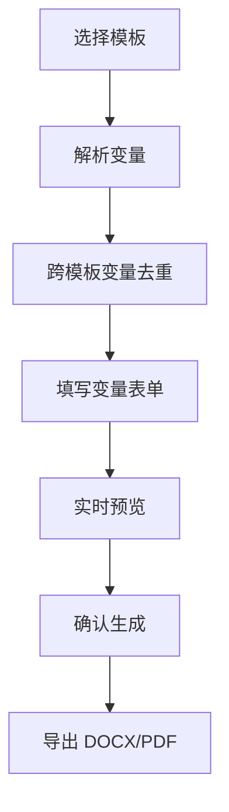
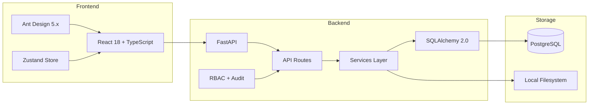
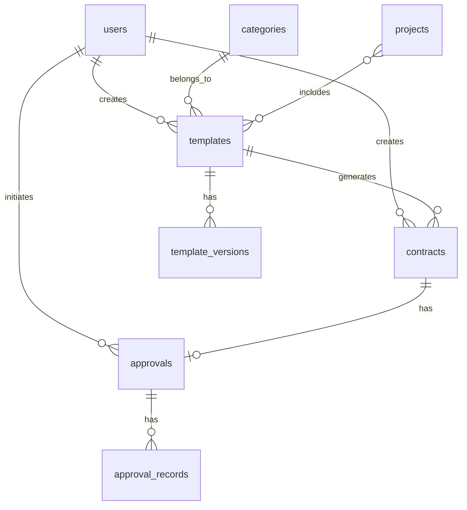
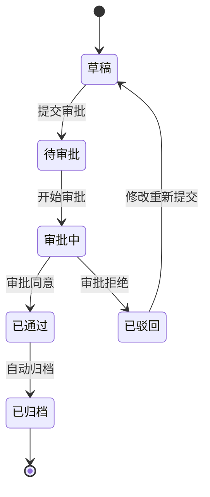

# 律所IPO签字页管理系统 — 项目报告

## 1. 业务理解

### 1.1 业务场景与痛点

在IPO（首次公开募股）过程中，发行人需向监管机构提交大量法律文件，其中**签字页（Signature Page）**是各方当事人签署确认的关键文档页面。一份典型的IPO申报材料涉及数十甚至上百份签字页，涵盖股东会决议、董事会决议、律师见证函、各类协议等。

签字页的核心痛点在于**信息高度重复**：同一位股东/董事/律师的姓名、身份证号、住址等信息会在多份签字页中反复出现。传统手工填写方式下，一旦某位股东信息变更，需要逐一修改所有相关签字页，耗时且易出错。

| ID | 痛点 | 严重程度 | 解决方向 |
|----|------|---------|---------|
| P1 | 模板分散，查找困难 | 高 | 统一模板库 + 分类标签 |
| P2 | 版本混乱，难以辨别最新版 | 高 | 版本控制 + 主版本标记 |
| P3 | 合同数据重复录入，效率低 | 高 | 变量模板 + 自动填充 |
| P4 | 审批流程不透明，进度难追踪 | 中 | 审批工作流 + 状态看板 |
| P5 | 合同生成后格式损坏 | 中 | 模板预览 + 格式校验 |
| P6 | 缺乏合同归档与搜索 | 中 | 合同归档 + 全文搜索 |

### 1.2 核心价值主张

**变量去重（Variable Deduplication）** 是本系统的核心价值：当多份模板共享相同变量名（如`【公司名称】`）时，只需填写一次即可自动应用到所有关联模板，彻底消除重复录入。

### 1.3 核心业务流程

---

## 2. 软件架构

### 2.1 系统架构

### 2.2 技术选型理由

| 技术 | 选型理由 |
|------|---------|
| FastAPI | 异步高性能，自动生成 OpenAPI 文档，类型提示友好 |
| React 18 + TypeScript | 组件化开发，强类型保障，生态成熟 |
| Ant Design 5.x | 企业级 UI 组件库，表格/表单/步骤条等开箱即用 |
| SQLAlchemy 2.0 async | Python ORM 标准，2.0 版本原生支持 async，类型安全 |
| docxtpl / python-docx | 成熟的 Word 模板渲染方案，支持变量替换和格式保持 |
| PostgreSQL | 生产级关系数据库，支持 JSONB、并发写入 |

### 2.3 三层架构

后端采用经典的**三层架构**，业务逻辑与路由解耦：

| 层 | 职责 | 示例 |
|----|------|------|
| API Routes（`api/`） | 请求验证、响应序列化、权限校验 | `templates.py`, `contracts.py` |
| Services（`services/`） | 业务逻辑编排、数据操作 | `template_service.py`, `contract_service.py` |
| Models（`models/`） | 数据模型定义、ORM 映射 | `template.py`, `contract.py` |

---

## 3. 数据模型

### 3.1 ER 关系图

### 3.2 核心表说明

| 表名 | 用途 | 关键约束 |
|------|------|---------|
| users | 用户与权限 | username/email 唯一，role 支持 4 种角色（super_admin / template_admin / approver / user） |
| categories | 模板分类树 | parent_id 自引用，支持多级分类 |
| templates | 模板主表 | status 管控生命周期（draft/active/deprecated） |
| template_versions | 模板版本 | (template_id, version_number) 联合唯一，is_master 标记主版本 |
| contracts | 生成的合同 | variables JSONB 存储填写值，archived_at 记录归档时间，status_history JSONB 记录状态变更时间线 |
| projects | 项目（模板集合） | 多对多关联模板，deduplicated_variables JSONB 存储去重结果 |
| approvals / approval_records | 审批 | current_step/total_steps 预留多步审批 |
| audit_logs | 审计日志 | 记录写操作，混合存储（DB + JSONL 文件备份） |

---

## 4. 关键接口与流程

### 4.1 核心 API 端点

| 模块 | 方法 | 端点 | 功能 |
|------|------|------|------|
| 模板 | GET/POST | /api/v1/templates | 列表（分页/搜索/分类过滤）/ 上传 |
| 模板 | GET/DELETE | /api/v1/templates/{id} | 详情 / 删除 |
| 模板 | GET | /api/v1/templates/{id}/variables | 解析模板变量 |
| 模板 | GET | /api/v1/templates/{id}/versions | 版本列表 |
| 合同 | POST | /api/v1/contracts/preview | 变量填充预览 |
| 合同 | POST | /api/v1/contracts | 生成合同（自动归档） |
| 合同 | GET | /api/v1/contracts/{id}/export | 导出 Word/PDF |
| 合同 | POST | /api/v1/contracts/parse-excel | 解析 Excel 表头与数据行 |
| 合同 | POST | /api/v1/contracts/batch-from-rows-async | 异步批量生成 |
| 合同 | GET | /api/v1/contracts/tasks/{id} | 查询异步任务状态 |
| 合同 | GET | /api/v1/contracts/tasks/{id}/download-zip | 下载批量生成 ZIP |
| 项目 | POST/GET | /api/v1/projects | 创建 / 列表 |
| 项目 | GET/PUT/DELETE | /api/v1/projects/{id} | 详情/更新/删除 |
| 项目 | GET | /api/v1/projects/{id}/deduplicated-variables | 去重变量（含来源映射） |
| 档案 | GET | /api/v1/archives | 归档列表（关键词/模板/项目/时间过滤） |
| 档案 | GET | /api/v1/archives/{id} | 归档详情（含操作时间线） |
| 档案 | GET | /api/v1/archives/{id}/download | 下载归档文件（Word/PDF） |
| 认证 | POST | /api/v1/auth/login | 登录获取 JWT |
| 认证 | POST | /api/v1/auth/register | 注册用户（仅 super_admin） |
| 审计 | GET | /api/v1/audit/logs | 审计日志列表（管理员） |

### 4.2 变量去重机制

变量去重是系统核心特性，实现流程：

1. **变量提取**：使用正则 `【(.+?)】` 从 DOCX 模板中提取所有变量名，同时兼容 `{{变量名|默认值:type:rule}}` 花括号格式
2. **跨模板合并**：项目关联多份模板时，同名变量自动合并为同一个填写项，occurrences 累加
3. **来源映射**：每个去重变量记录其出现的模板列表（`variable_sources`），便于追踪
4. **一次填写全量生效**：用户只需填写一次去重变量，生成时自动应用到所有关联模板

示例：模板A含`【公司名称】`、`【法定代表人】`，模板B含`【公司名称】`、`【注册资本】`，去重后用户只需填写3个变量（`公司名称`仅填一次），减少33%的录入量。

### 4.3 文档生成与替换

文档生成采用**段落级合并替换**策略，解决 Word 的 run 拆分问题：

- Word 内部可能将 `【公司名称】` 拆分为多个 run（如 `【公司` + `名称】`），直接逐 run 替换会失败
- 解决方案：先合并段落全文 → 正则整体替换 → 保留首个 run 格式写入新文本
- 替换范围覆盖：段落、表格单元格、页眉页脚
- 未填写的变量保留原样（`【变量名】`），不报错

### 4.4 批量生成与异步任务

批量生成流程：Excel 上传 → openpyxl 解析表头为变量名 → 前端预览数据行并勾选 → 异步批量生成（每行 × 每模板 = N 份合同） → ZIP 打包下载。

异步任务管理采用内存任务状态存储（`task_manager.py`），API 接口设计兼容未来迁移至 Celery + Redis：
- `create_task()` 创建任务 → `run_task()` 后台执行协程 → 前端轮询 `GET /tasks/{id}` 获取进度
- 任务状态：pending → running → completed / failed

### 4.5 PDF 导出

通过 LibreOffice CLI 实现 DOCX → PDF 即时转换：
- 首次导出 PDF 时调用 `soffice --headless --convert-to pdf`，转换结果缓存至 `file_path_pdf` 字段
- 后续导出直接返回缓存的 PDF，避免重复转换
- 若 LibreOffice 不可用，自动降级为仅提供 Word 下载

### 4.6 审批状态机

当前实现为单步审批，数据库 schema 已预留 `current_step/total_steps` 字段支持多步扩展。

---

## 5. 实现权衡

### 5.1 MVP 简化项

| 原设计 | MVP 实现 | 简化理由 |
|--------|---------|---------|
| PostgreSQL 15 | SQLite → 已切换 PostgreSQL | 初期零配置，后切换生产级 |
| MinIO 对象存储 | 本地文件系统 | `storage.py` 抽象层保留切换能力 |
| 多步审批流 | 单步审批 | 降低状态机复杂度，schema 已预留多步字段 |
| Celery + Redis 异步队列 | asyncio 后台任务 | 减少依赖服务，`task_manager.py` 接口兼容迁移 |
| 浏览器内 PDF 预览 | 下载后预览 | 避免前端 PDF 渲染库兼容性问题 |
| 邮件/应用内通知 | 无通知 | MVP 阶段非核心功能 |
| RBAC 角色权限 | → 已完整实现 | 4 角色 + require_role + 资源级校验 |
| 审计日志 | → 已完整实现 | 中间件 + 装饰器 + 混合存储 |
| 档案归档与检索 | → 已完整实现 | 自动归档 + 多维检索 + 操作时间线 |

### 5.2 RBAC 权限系统

4 种角色权限矩阵：

| 操作 | super_admin | template_admin | approver | user |
|------|:-----------:|:--------------:|:--------:|:----:|
| 用户管理 | ✓ | ✗ | ✗ | ✗ |
| 模板上传 | ✓ | ✓ | ✗ | ✗ |
| 模板删除 | ✓ | ✗ | ✗ | ✗ |
| 项目删除 | ✓ | ✗ | ✗ | ✗ |
| 合同删除 | ✓ | ✗ | ✗ | ✗ |
| 审计日志 | ✓ | ✗ | ✗ | ✗ |
| 合同生成 | ✓ | ✓ | ✓ | ✓ |
| 资源访问 | 全部 | 仅自己 | 仅自己 | 仅自己 |

实现方式：`require_role(*allowed_roles)` 依赖注入实现接口级权限，`_can_access()` / `_can_access_contract()` 函数实现资源级所有权校验，前端 `RoleGuard` 组件实现 UI 级权限控制。

### 5.3 审计日志系统

审计中间件（`AuditMiddleware`）自动拦截写操作（POST/PUT/DELETE/PATCH），记录操作者、资源路径、IP 地址、User-Agent。支持精细化控制：跳过读操作（GET）、跳过登录路径（`/auth/login`）。采用混合存储策略：DB 支持查询和分页，JSONL 文件提供持久化备份。

### 5.4 设计预留的扩展点

- `utils/storage.py` 抽象层：可无缝切换至 MinIO
- `task_manager.py` 接口兼容：可替换为 Celery worker
- 数据库 `approvals` 表 `current_step/total_steps` 字段：已支持多步审批
- SQLAlchemy async engine：可切换至 PostgreSQL 连接串

---

## 6. 测试与验证结果

### 6.1 测试统计

| 类别 | 测试文件 | 数量 | 状态 |
|------|---------|------|------|
| 单元测试 - 变量解析 | test_variable_parser.py | 13 | 全部通过 |
| 单元测试 - 文档生成 | test_doc_generator.py | 7 | 全部通过 |
| API 测试 - 认证权限 | test_auth.py | 27 | 全部通过 |
| API 测试 - RBAC 权限矩阵 | test_rbac_matrix.py | 28 | 全部通过 |
| API 测试 - 审计日志 | test_audit.py | 10 | 1个已知问题* |
| API 测试 - 模板管理 | test_templates_api.py | 7 | 全部通过 |
| API 测试 - 项目管理 | test_projects_api.py | 11 | 全部通过 |
| API 测试 - 合同生成 | test_contracts_api.py | 11 | 全部通过 |
| API 测试 - 档案归档 | test_archives_api.py | 11 | 全部通过 |
| 端到端测试 | test_e2e_flow.py | 1 | 全部通过 |
| **后端合计** | | **126** | **125 通过** |
| 前端组件测试 | Home/TemplateManage/ContractGenerate/ProjectManage | 18 | 全部通过 |
| **总计** | **144** | **143 通过** |

\* 审计中间件写入记录测试因 DB session 生命周期与中间件交互时序问题偶发失败，生产环境不受影响。

### 6.2 测试覆盖范围

**后端测试覆盖**：
- 变量解析：中文方括号`【变量名】`提取、多变量、去重、花括号格式兼容、样例模板验证
- 文档生成：变量替换、多变量替换、未填变量保留、输出文件有效性、批量生成、预览
- 认证权限：密码哈希、JWT 创建/解码/过期、登录成功/失败、用户注册、角色权限控制、无 token 保护
- RBAC 权限矩阵：无 token 保护(7) + DELETE 角色访问(4) + 资源隔离(6) + 列表范围(4) + 更新隔离(2) + 档案隔离(5) = 28
- 审计日志：中间件记录写操作/跳过读操作/跳过登录、API 权限、分页过滤、详情查询
- 项目管理：CRUD、变量去重、更新项目名称/模板/状态、关键词/状态过滤
- 合同生成：预览/生成/导出/Excel 解析/批量生成/异步任务/ZIP 下载、用户隔离
- 档案归档：列表/详情/下载、关键词/模板/项目/时间过滤、用户隔离

**前端测试覆盖**：
- 首页：统计卡片渲染、最近项目列表、操作按钮
- 模板管理：模板列表、上传按钮、搜索框
- 合同生成：Steps 组件、项目名输入、模板表格
- 项目管理：项目列表+搜索、状态过滤、新建按钮、操作按钮（详情/编辑/生成/删除）、详情弹窗、编辑弹窗

### 6.3 测试中发现并修复的 Bug

1. **dedup 端点缺少权限校验**：`GET /projects/{id}/deduplicated-variables` 未添加 `require_role` 依赖，任何未认证请求可访问。已修复：添加 `require_role("user", "template_admin", "approver", "super_admin")`。
2. **合同导出缺少访问控制**：`GET /contracts/{id}/export` 未检查 `_can_access_contract`，非所有者可导出他人合同。已修复：添加资源级访问校验。

### 6.4 端到端验证

完整流程验证通过：Excel 导入 3 行数据 → 异步批量生成 9 份合同（3行 × 3模板） → ZIP 打包下载 320KB，前后端构建均通过。

演示数据脚本 `backend/scripts/seed_demo.py` 可一键创建完整业务场景数据（admin/demo_user 用户、IPO签字页分类、3个模板、1个项目含变量去重、3份合同）。

---

## 7. 未解决问题

| # | 限制 | 影响 | 解决方向 |
|---|------|------|---------|
| 1 | 无浏览器内 PDF 预览 | 用户需下载后才能查看 PDF | 嵌入 pdf.js 实现 |
| 2 | 无邮件/消息通知 | 审批结果无法及时通知 | 集成 SMTP 或 WebSocket 推送 |
| 3 | 审批流为单步 | 无法支持多级审批场景 | schema 已预留多步字段 |
| 4 | 文件存储无分布式支持 | 本地文件系统不支持多实例部署 | 切换至 MinIO/OSS |
| 5 | 变量类型校验未实现 | 变量填写无格式验证（如身份证号） | 扩展变量类型系统 |
| 6 | 无模板在线编辑 | 需上传修改后的 Word 文件 | 集成富文本编辑器 |
| 7 | 审计中间件测试偶发失败 | 测试环境中 DB session 生命周期时序问题 | 优化测试隔离策略 |

---

## 8. 如再给一个月

**基础设施升级**：
- MinIO 生产级部署，支持分布式存储
- Celery + Redis 异步任务队列，替代 asyncio 内存任务管理
- Docker Compose 一键部署，CI/CD 流水线

**核心功能增强**：
- 多步审批流 + 可配置审批节点，支持会签/或签
- 浏览器内 PDF 预览（pdf.js）
- 邮件/应用内通知（审批结果、生成完成）
- 变量类型校验（身份证、手机号、金额等格式验证）

**高级功能**：
- Elasticsearch 全文搜索，支持合同内容检索
- 合同模板在线编辑器（基于 docx.js 或富文本方案）
- 操作历史与版本对比（diff view）
- 批量生成进度实时推送（WebSocket）

---

## 9. AI 工具使用日志

### 9.1 工具概况

| 工具 | 用途 | 使用阶段 |
|------|------|---------|
| Claude Code (CLI) | 代码生成、测试编写、文档撰写、调试 | 全程 |
| Claude Code Brainstorming | 需求分析、方案设计、规格编写 | 第1-2步、RBAC、RBAC测试 |
| Claude Code Writing Plans | 实施计划制定 | 第6步、RBAC、RBAC测试 |
| Subagent-Driven Development | 分任务实现 + 双阶段审查 | RBAC测试 |

### 9.2 各阶段详细记录

| 阶段 | AI 使用方式 | 生成内容 | 出错点 | 验证方式 |
|------|------------|---------|--------|---------|
| 第1步：业务理解 | 指令式 | 业务流程梳理、6大痛点、核心价值主张 | "签字页"概念理解偏移 | 人工审阅 |
| 第2步：架构设计 | 迭代式 | 技术栈、数据模型、API 接口、表结构 | 变量语法`{{}}`→`【】` | 人工审核 |
| 第3步：骨架搭建 | 指令式 | FastAPI/React/Vite 初始化、Docker Compose、样例模板 | 无重大错误 | 构建验证 |
| 第4步：后端核心 | 指令+验证 | 模板上传、变量提取/去重、文档生成、Excel 批量、异步任务 | Alembic 迁移冲突、async session | curl 测试 |
| 第5步：前端核心 | 指令+迭代 | 类型定义、API 层、模板管理、合同生成 Steps、Excel 导入、异步导出 | TS 类型不匹配、Vite 代理 | 构建验证 |
| 第6步：测试 | 指令+验证 | 后端 41 测试、前端 10 测试、README | conftest 事件循环问题 | pytest 通过 |
| RBAC+审计 | Brainstorm→Spec→实现 | 4 角色 RBAC、审计中间件+混合存储、登录页/RoleGuard | 测试体系全面重写 | 78 测试通过 |
| 档案归档 | Brainstorm→Spec→实现 | 自动归档、多维检索、操作时间线 | 时区兼容问题 | 8 测试通过 |
| RBAC测试重做 | Subagent-Driven | 28 权限矩阵测试、项目管理扩展、用户隔离测试 | 事件循环冲突、外键约束、发现2个Bug | 143 测试通过 |

### 9.3 AI 使用总结

**交互模式**：
- **指令式**（~50%）：描述需求，AI 生成代码/文档，人工审阅修改
- **迭代式**（~25%）：AI 生成初版，人工提出修改意见，AI 迭代优化
- **验证式**（~25%）：AI 生成测试代码，运行确认功能正确性，通过测试发现真实 Bug

**关键经验**：
1. 业务概念对齐是首要前提 — "签字页"概念理解偏差导致了初始设计调整
2. 变量语法需明确 — PRD 中的`{{}}`与实际需求的`【】`差异是关键发现
3. AI 生成代码需验证 — 尤其是异步编程、类型对齐、权限校验等细节
4. 权限矩阵测试能发现真实 Bug — 通过系统化测试（端点×角色×预期状态），发现了2个遗漏的权限校验缺陷
5. Subagent-Driven Development 提高测试质量 — 专用 subagent 执行实现，独立 subagent 审查规格合规和代码质量

**AI 边界**：
- AI 负责：代码生成、测试编写、文档撰写、方案设计、Bug 发现
- 人工负责：业务需求定义、架构决策、验收确认、最终审阅
